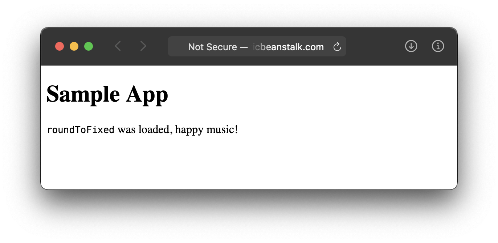

# github-to-beanstalk
Deploy from GitHub to AWS Elastic Beanstalk - A Demo
---
This is a demonstration of how to automatically deploy a sample Node.js app to AWS Elastic Beanstalk whenever a git branch is pushed to GitHub.
## Required items

### AWS user credentials
- access key ID (stored in GitHub *Settings > Secrets* as `AWS_ACCESS_KEY_ID`)
- secret access key (stored in GitHub *Settings > Secrets* as `AWS_SECRET_ACCESS_KEY`)

For instruction on obtaining AWS Elastic Beanstalk user credentials, see the
tutorial
[Set up the Elastic Beanstalk Command Line Interface](https://aws.amazon.com/getting-started/hands-on/set-up-command-line-elastic-beanstalk/).

### AWS application data
- application name
- environment name
- AWS region name (ex. us-west-2)

For instructions on creating an application in Elastic Beanstalk, see
the tutorial
[Getting started using Elastic Beanstalk](https://docs.aws.amazon.com/elasticbeanstalk/latest/dg/GettingStarted.html)

## Relevant files

### .github/scripts/build.sh
An app-specific bash script that populates the *build* folder contents by:
1. copying *app.js, index.html, package.json* to build folder.
2. running `npm install --only=production` to add node modules to build folder.

### .github/scripts/make-deploy.sh
A bash script that creates the `deploy.zip` file for uploading.

### .github/workflows/main-to-eb.yml
A GitHub Actions file that runs when the ***main*** branch is pushed. Steps:
1. check out the main branch
2. runs ***build.sh*** to populate the *build* folder
3. runs the ***make-deploy*** script to create *deploy.zip*
4. runds the ***Beanstalk Deploy*** to deploy a new version to AWS

## The deployed site

The deployed public site is:

[githubebdemo.us-west-2.elasticbeanstalk.com](http://githubebdemo.us-west-2.elasticbeanstalk.com)

The sample is a node.js app, so seeing anything displayed means that the app is
running. The app uses `roundToFixed` as a node module, so "roundToFixed was
loaded means that the module was correctly loaded during the build process."

## Example screens

### GitHub repo Settings > Secrets
The required AWS user credentials stored to repo's *Settings > Secrets* page:

### GitHub repo > Actions > Summary
After a deploy, the GitHub repo's actions > summary page:

### Elastic Beanstalk status
After a successful deploy, the Elastic Beanstalk > Environments page:

## GitHub Actions used

#### [Checkout V2](https://github.com/marketplace/actions/checkout) (1.4k stars)
Checks-out your repository under `$GITHUB_WORKSPACE`, so your workflow can
access it.

#### [Get current package version](https://github.com/marketplace/actions/get-current-package-version) (28 stars)
Retrieves the package version from the **package.json** file and sets the
version in the `current-version` output value.

#### [Beanstalk Deploy](https://github.com/marketplace/actions/beanstalk-deploy) (158 stars)
Deploy apps to AWS Elastic Beanstalk. It takes the application name,
environment name, version name, region and filename as parameters, uploads
the file to S3, creates a new version in Elastic Beanstalk, and then deploys
that version to the environment. **Note:** Requires a zip file as the source.

